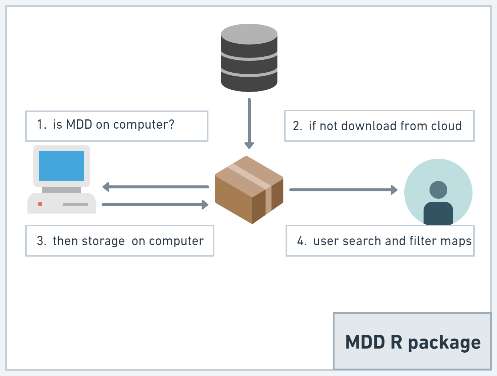

<!-- README.md is generated from README.Rmd. Please edit that file -->

```{r, include = FALSE}
knitr::opts_chunk$set(
  collapse = TRUE,
  comment = "#>",
  fig.path = "man/figures/README-",
  out.width = "100%"
)
```

# mdd

<!-- badges: start -->
<!-- badges: end -->

The goal of mdd is to provide an interface to
download and manipulate spatial range maps for mammals according with Mammal Diversity Database taxonomy.
Currently the map version is related to MDD v1.2


## Installation

You can install the development version of mdd from [GitHub](https://github.com/) with:

``` r
# install.packages("devtools")
devtools::install_github("alrobles/mdd")
```
## Summary
Expert geographic range maps aligned to the taxonomy of the Mammal Diversity Database (MDD) version 1.2, which was [published](https://zenodo.org/record/4139818) on 24 Sept 2020.  That taxonomy includes 6,485 total species, of which 103 are considered recently extinct, 20 are considered domestic extant, and 6,362 are considered wild extant.  For this mapping project, only 6,362 species from MDD v1.2 have maps. The original source of this R package can be found [here](https://zenodo.org/record/6644198)

Original files need 10 gigabytes of storage in a compressed format. For the distribution of this R package, we decreased the resolution by simplifying the lines of the polygons by removing vertices with a tolerance of 1000 meters. We store the files as r binaries for more efficient manipulation using the terra R package.

Finally we add the possibility of filtering these polygons by species and order. We also added a geographic filter that returns the maps by country or continent. It is possible to crop the maps with the country or leave the complete ranges that intersect with that country.

In order to distribute this package, the maps are stored on a remote cloud server. Once the user performs a query, a local copy of the maps are stored on the user's computer. 

The functions first look to see if the maps are already stored on the user's computer, if not, it downloads them for future reference. Because this service is managed with our own resources, we make this feature notable to prevent the user from hitting our database every time a user makes a query and in this way also offer a faster experience when generating multiple queries. map sets.



## Basic usage

This is a basic example which shows how to look an 
specific map:

```{r example1}
library(mdd)
library(terra) # for plot
mammal <- get_mdd_map("Notoryctes caurinus")
plot(mammal)
```

You can search by order and country:
```{r example2}
library(mdd)
library(terra) # for plot
rodents_mexico <- get_mdd_map(Order = "Rodentia", country = "Mexico", cropCountry = TRUE)
plot(rodents_mexico)
```

Also you can search by order and continent. In this case 
the first time takes a while because :
```{r example3}
library(mdd)

library(terra) # for plot
rodents_NA <- get_mdd_map(Order = "Chiroptera", continent = "North America", cropCountry = TRUE)
plot(rodents_NA)
```

